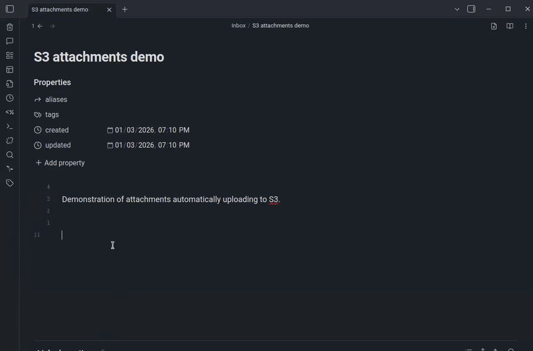

# S3 Attachments


An [Obsidian](https://obsidian.md/) plugin for storage and retrieval of media attachments on S3 compatible services.

When you copy-paste an image, video, audio, or document into your note, this plugin will upload it to your S3 bucket and rewrite the link to the uploaded file. It also supports uploading existing attachments to S3 and rewriting the links in your notes.



This is a maintained fork of [`ttax00/obsidian-s3`](https://github.com/ttax00/obsidian-s3). Huge thanks to the original author(s) for the foundation.

This fork includes significant additions and behavior changes, including:
- Public URL link mode (embed `https://...` links instead of `http://localhost:...`)
- Optional local proxy server for private S3 buckets
- Safer “clear unused” behavior across multiple clients
- A conversion tool to upload existing local attachments to S3 and rewrite links.


## Manually installing the plugin
- Copy over `main.js` and `manifest.json` to your vault `VaultFolder/.obsidian/plugins/s3-attachments/`.

## Commands

- **Upload existing attachments to S3 and rewrite links…**
  - Opens a modal where you can choose **scope** (current note / current folder / entire vault), **dry-run**, whether to create `.bak` copies, and link mode (**Proxy** vs **Public**).
- **Convert attachments in current note**
- **Convert attachments in current folder**
- **Convert attachments in entire vault**
- **Clear unused s3 objects**
- **Get usage statistics**

### Conversion workflow (recommended)

- Run **dry-run** first and review the report preview.
- If it looks good, run again with dry-run off.
- If enabled, each modified note will get a side-by-side **`.bak`** copy.

## Settings (AWS example)

- **Endpoint**: For AWS S3 you can use `https://s3.<your-region>.amazonaws.com` (replace `<your-region>`, e.g. `us-east-1`). The plugin extracts the hostname. Other S3-compatible providers will have their own endpoint.
- **Folder Name**: Prefix inside the bucket (e.g. `files`).
- **Link mode**:
  - **Local proxy**: writes `http://localhost:4998/<folder>/<file>?client=...&bucket=...` (works with private buckets). **These links will break unless the plugin's local proxy server is enabled and running.**
  - **Public URL**: links will point to the public S3 URL instead of the localhost URL: `https://<public-base>/<folder>/<file>` (requires your bucket/objects to be publicly readable).
- **Public Base URL** (when Link mode = Public): for AWS, typically `https://<bucket>.s3.<region>.amazonaws.com`.

## IAM permissions

This plugin needs both bucket-level and object-level permissions. The following policy grants both:

```json
{
  "Version": "2012-10-17",
  "Statement": [
    {
      "Sid": "BucketLevel",
      "Effect": "Allow",
      "Action": [
        "s3:GetBucketLocation",
        "s3:ListBucket"
      ],
      "Resource": "arn:aws:s3:::your-bucket-name"
    },
    {
      "Sid": "ObjectLevel",
      "Effect": "Allow",
      "Action": [
        "s3:GetObject",
        "s3:PutObject",
        "s3:DeleteObject"
      ],
      "Resource": "arn:aws:s3:::your-bucket-name/*"
    }
  ]
}
```

### Optional: make uploaded objects publicly readable

If you want attachments to be directly accessible via `https://<bucket>.s3.<region>.amazonaws.com/<prefix>/<key>`, you must also configure **bucket policy / Block Public Access** accordingly.

Example bucket policy:

```json
{
  "Version": "2012-10-17",
  "Statement": [
    {
      "Sid": "PublicReadPrefix",
      "Effect": "Allow",
      "Principal": "*",
      "Action": "s3:GetObject",
      "Resource": "arn:aws:s3:::your-bucket-name/your-prefix/*"
    }
  ]
}
```

Notes:
- Keep **Block Public Access** enabled unless you explicitly want public objects.
- If you keep the bucket private, the plugin can still fetch objects using credentials via its local proxy URLs (e.g. `http://localhost:4998/...`).

## Feature list
Supported files (limited by files allowed to be linked by Obsidian). By default, this plugin supports:

- Images: `.ico`, `.png`, `.jpg`/`.jpeg`, `.gif`, `.svg`
- Audio: `.mp3`, `.wav`
- Video: `.mp4`, `.webm`
- Documents/archives (as links): `.pdf`, `.zip`, `.doc`

You can customize this list in the plugin settings under **Allowed MIME Types**.

## Development
- Clone this repo.
- `npm i` (or `pnpm i`) to install dependencies.
- `npm run build` (or `pnpm build`) to generate `main.js`.


## Many thanks
Inspiration taken from:
- [`ttax00/obsidian-s3`](https://github.com/ttax00/obsidian-s3)
- [`musug/obsidian-paste-png-to-jpeg`](https://github.com/musug/obsidian-paste-png-to-jpeg)
- [`gavvvr/obsidian-imgur-plugin`](https://github.com/gavvvr/obsidian-imgur-plugin)
- [`elias-sundqvist/obsidian-static-file-server`](https://github.com/elias-sundqvist/obsidian-static-file-server)

